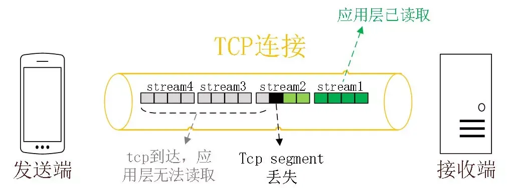

>Google家是真的DIAO啊，掌控了http的发展啊。

### Quic简述
Quic 全称 quick udp internet connection，“快速 UDP 互联网连接”，是由 google 提出的使用 udp 进行多路并发传输的协议。

### 为啥需要Quic
为毛需要Quic，因为http2.0有一些硬伤难以解决，啥硬伤呢？就是TCP。 
经过几十年的经验累积，网络工程师对怎么优化网络访问，降低延迟也有了新的认知，于是就想着更新 TCP 协议，但是 TCP 的更新非常困难，因为网络协议栈的实现本来就依赖系统内核更新，而不管是终端设备，中间设备的系统更新都极其缓慢，一个更新迭代可能需要5-15年的时间去普及，对于现在的互联网发展来说太慢了。

所以 TCP 的硬伤总结一下就是：TCP的更新优化需要依赖系统内核更新。

#### 基础环境的不match
##### 中间设备的僵化
目前，我们很多中间设备，比如防火墙、NAT网关等出现了一些默认的动作。

比如防火墙只允许通过80和443，不放通其他端口。NAT 网关在转换网络地址时重写传输层的头部，有可能导致双方无法使用新的传输格式。整流器和中间代理有时候出于安全的需要，会删除一些它们不认识的选项字段。
TCP 协议本来是支持端口、选项及特性的增加和修改。但是由于 TCP 协议和知名端口及选项使用的历史太悠久，中间设备已经依赖于这些潜规则，所以对这些内容的修改很容易遭到中间环节的干扰而失败。

而这些干扰，也导致很多在 TCP 协议上的优化变得小心谨慎，步履维艰。

##### 依赖于操作系统的实现导致协议僵化
TCP 是由操作系统在内核西方栈层面实现的，应用程序只能使用，不能直接修改。虽然应用程序的更新迭代非常快速和简单。但是 TCP 的迭代却非常缓慢，原因就是操作系统升级很麻烦。

现在移动终端更加流行，但是移动端部分用户的操作系统升级依然可能滞后数年时间。PC 端的系统升级滞后得更加严重，windows xp 现在还有大量用户在使用，尽管它已经存在快 20 年。

服务端系统不依赖用户升级，但是由于操作系统升级涉及到底层软件和运行库的更新，所以也比较保守和缓慢。

这也就意味着即使 TCP 有比较好的特性更新，也很难快速推广。比如 TCP Fast Open。它虽然 2013 年就被提出了，但是 Windows 很多系统版本依然不支持它。
#### 连接建立快
现在，网络建立在TCP之上，因为它作为传输协议的可靠性。要启动TCP连接，将执行3次握手。这意味着每个起始连接的额外往返（网络数据包来回发送）会增加任何新连接的显着延迟。另外，如果还需要TLS创建安全加密的https连接，则需要发送更多的网络数据包。

当客户端首次发起QUIC连接时，客户端想服务器发送一个client hello消息，服务器回复一个server reject消息。该消息中有包括server config，类似于TLS1.3中的key_share交换。这需要产生1-RTT. 事实上，QUIC加密协议的作者也明确指出当前的QUIC加密协议是「注定要死掉的」(destined to die), 未来将会被TLS1.3代替。只是在QUIC提出来的时候，TLS1.3还没出生😂，这只是一个临时的加密方案。

当客户端获取到server config以后，就可以直接计算出密钥，发送应用数据了，可以认为是0-RTT。因此，QUIC握手除去首次连接需要产生1-RTT，理论上，后续握手都是0-RTT的。假设1-RTT=100ms, QUIC建立安全连接连接的握手开销为0ms, 功能上等价于TCP+TLS, 但是握手开销比建立普通的TCP连接延迟都低。

#### 没有队头阻塞的多路复用
QUIC 的多路复用和 HTTP2 类似。在一条 QUIC 连接上可以并发发送多个 HTTP 请求 (stream)。但是 QUIC 的多路复用相比 HTTP2 有一个很大的优势。

QUIC 一个连接上的多个 stream 之间没有依赖。这样假如 stream2 丢了一个 udp packet，也只会影响 stream2 的处理。不会影响 stream2 之前及之后的 stream 的处理。

这也就在很大程度上缓解甚至消除了队头阻塞的影响。

多路复用是 HTTP2 最强大的特性 [7]，能够将多条请求在一条 TCP 连接上同时发出去。但也恶化了 TCP 的一个问题，队头阻塞 [11]，如下图示：

HTTP2 在一个 TCP 连接上同时发送 4 个 Stream。其中 Stream1 已经正确到达，并被应用层读取。但是 Stream2 的第三个 tcp segment 丢失了，TCP 为了保证数据的可靠性，需要发送端重传第 3 个 segment 才能通知应用层读取接下去的数据，虽然这个时候 Stream3 和 Stream4 的全部数据已经到达了接收端，但都被阻塞住了。

不仅如此，由于 HTTP2 强制使用 TLS，还存在一个 TLS 协议层面的队头阻塞 [12]。

Record 是 TLS 协议处理的最小单位，最大不能超过 16K，一些服务器比如 Nginx 默认的大小就是 16K。由于一个 record 必须经过数据一致性校验才能进行加解密，所以一个 16K 的 record，就算丢了一个字节，也会导致已经接收到的 15.99K 数据无法处理，因为它不完整。

那 QUIC 多路复用为什么能避免上述问题呢？

+ QUIC 最基本的传输单元是 Packet，不会超过 MTU 的大小，整个加密和认证过程都是基于 Packet 的，不会跨越多个 Packet。这样就能避免 TLS 协议存在的队头阻塞。
+ Stream 之间相互独立，比如 Stream2 丢了一个 Pakcet，不会影响 Stream3 和 Stream4。不存在 TCP 队头阻塞。

#### 更高效的拥塞控制

目前的 QUIC 的拥塞控制主要实现了 TCP 的慢启动，拥塞避免，快重传，快恢复。在这些拥塞控制算法的基础上，再进行改进。

比如单调递增的 Packet Number。TCP 使用了基于字节序号 Sequence Number 和 ACK 来保证消息的有序到达。但是 Sequence Number 在重传的时候有二义性。你不知道下一个 ACK 是上一次请求的响应还是这次重传的响应。而单调递增的 Packet Number 可以避免这个问题，保证采样 RTT(数据从一端到另一端的往返时间) 的准确。

> 具体改进可以参考[这篇文章](https://zhuanlan.zhihu.com/p/32553477)

QUIC 拥塞控制算法主要重新实现了一遍 TCP 的算法，毕竟 TCP 的算法是经过几十年的生产验证的。

#### 可插拔

什么叫可插拔呢？就是能够非常灵活地生效，变更和停止。体现在如下方面：

1. 应用程序层面就能实现不同的拥塞控制算法，不需要操作系统，不需要内核支持。这是一个飞跃，因为传统的 TCP 拥塞控制，必须要端到端的网络协议栈支持，才能实现控制效果。而内核和操作系统的部署成本非常高，升级周期很长，这在产品快速迭代，网络爆炸式增长的今天，显然有点满足不了需求。
2. 即使是单个应用程序的不同连接也能支持配置不同的拥塞控制。就算是一台服务器，接入的用户网络环境也千差万别，结合大数据及人工智能处理，我们能为各个用户提供不同的但又更加精准更加有效的拥塞控制。比如 BBR 适合，Cubic 适合。
3. 应用程序不需要停机和升级就能实现拥塞控制的变更，我们在服务端只需要修改一下配置，reload 一下，完全不需要停止服务就能实现拥塞控制的切换。
STGW 在配置层面进行了优化，我们可以针对不同业务，不同网络制式，甚至不同的 RTT，使用不同的拥塞控制算法。

#### 前向纠错

QUIC的一个很好的功能是FEC或前向纠错。发送的每个数据包还包括其他数据包的足够数据，以便可以重建丢失的数据包而无需重新传输。

这实际上是网络级别的RAID 5。

因此，需要进行权衡：每个UDP数据包包含的负载超出了严格必要的数量，因为它可以解决丢失数据包的可能性，这种数据包可以更容易地以这种方式重新创建。

当前比率似乎约为10个数据包。因此，对于每发送10个UDP数据包，有足够的数据来重建丢失的数据包。如果你愿意，可以节省10％的开销。

将前向纠错视为可以发送的“每UDP数据包数据”的牺牲，但增益不必重新发送丢失的数据包，这将花费更长的时间（收件人必须确认丢失的数据包，请求它再次等待回应）。
#### 会话恢复和并行下载

在TCP中，需要四个参数建立连接，源IP、源端口和目的IP、目的端口。如果任何参数（源IP /端口或目标IP /端口）发生更改，则需要进行新的TCP连接。如果任何参数（源IP /端口或目标IP /端口）发生更改，则需要进行新的TCP连接。
使用QUIC，因为它现在使用UDP，所以没有四元组。

QUIC为称为Connection UUID的唯一连接实现了自己的标识符。从WiFi到LTE仍然可以保持连接UUID，因此无需重新协商连接或TLS。之前的连接仍然有效。

这与Mosh Shell的工作方式相同，通过UDP保持SSH连接，以获得更好的漫游和移动体验。

这也打开了使用多个来源获取内容的大门。如果可以通过WiFi 和蜂窝连接共享连接UUID ，理论上可以使用两种媒体来下载内容。用户可以使用拥有的每个可用界面并行地有效地流式传输或下载内容。

虽然仍然是理论上的，但UDP允许这种创新。

参考连接[https://zhuanlan.zhihu.com/p/32553477](https://zhuanlan.zhihu.com/p/32553477)