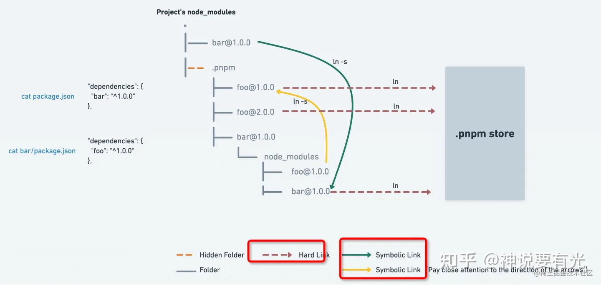

## 原理
所有的依赖都是从全局 store 硬连接到了 node_modules/.pnpm 下，然后之间通过软链接来相互依赖。


## 优势

### 不能访问没有声明的依赖
项目最外层node_modules里面只有一个.pnpm和axios两个文件，没有把所有依赖包铺平，在项目里面就不能引入其他包了，不存在幽灵依赖问题了

### 硬链接和软链接
```
node_modules
└── bar // symlink to .pnpm/bar@1.0.0/node_modules/bar
└── foo // symlink to .pnpm/foo@1.0.0/node_modules/foo
└── .pnpm
    ├── bar@1.0.0
    │   └── node_modules
    │       └── bar -> <store>/bar
    │           ├── index.js
    │           └── package.json
    └── foo@1.0.0
        └── node_modules
            └── foo -> <store>/foo
                ├── index.js
                └── package.json
```

node_modules 中的 bar 和 foo 两个目录会软连接到 .pnpm 这个目录下的真实依赖中，而这些真实依赖则是通过 hard link 存储到全局的 store 目录中。

### 节省磁盘空间

axios包、axios的依赖包、依赖包的依赖包，依赖包的依赖包的依赖包，...，都只在硬盘中只存在一份，其余的都是软链接，并且可以跨项目使用同一版本的依赖，比如有3个项目都用了axios@1.6.2这个版本，它在硬盘仓库地址只有一份，然后硬链接到这个3个项目的node_modules的.pnpm里面，这样空间就大大的节省了

### 安装速度快

使用 npm 时，依赖每次被不同的项目使用，整个包都会重复安装一次。
而使用pnpm时，假如你上一个项目已经使用pnpm安装了axios@1.6.1这个版本到硬盘仓库地址里面，新项目中，你要安装axios@1.6.2，假如这个两个版本中只有axios.js这个文件变动了，那么磁盘中只会重新安装这一个变动文件，然后硬链接到你新项目的.pnpm中，而不会因为仅仅一个文件的改变复制整新版本包的内容。这样既节省空间而且速度也更快。

### tips

+ 硬链接：只能引用同一文件系统中的文件。它引用的是文件在文件系统中的物理索引（inode）。当移动或者删除原始文件时，硬链接不会被破坏，因为它所引用的是文件的物理数据而不是文件在文件结构中的位置。硬链接记录的是目标的inode。同一文件的不同硬链接文件相当于该文件的多个不同文件名，即多个不同访问路径，他们的inode都是一样的。不可以为目录创建软连接。

+ 符号链接：和原文件不是同一个文件，符号链接会有自己的inode，它所引用的是原文件的path，当原文件被移动或删除的时候，符号链接的文件就不可以。例如windows中的快捷方式。也可以为目录创建软连接。
如何建立硬链接和软连接呢
可以使用ln命令来创建

+ ln 原文件名 硬链接文件名, 例如： ln file hardfile,就是创建了file文件的硬链接文件hardfile

+ ln -s 原文件名 硬链接文件名,例如： ln -s file softfile,就是创建了file文件的硬链接文件softfile
在系统中查看操作一遍（执行以下命令）

作者：我就是小傲娇
链接：https://juejin.cn/post/7114117329687937032
来源：稀土掘金
著作权归作者所有。商业转载请联系作者获得授权，非商业转载请注明出处。